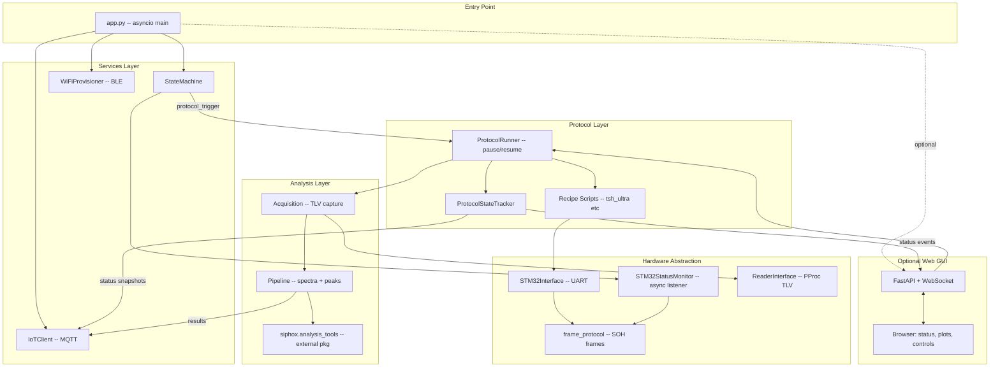
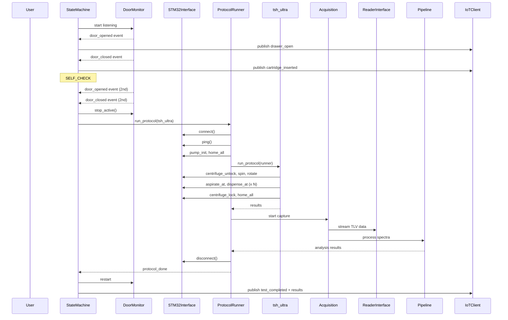

# Ultra RPi Software Architecture

Canonical design and implementation reference for this repository. For a
shorter overview, see the root `README.md`.

## Context

The existing `sway` repo is a monolithic GUI application (~50+ instruments, Qt UI, multi-process architecture) that happens to support Ultra hardware as one of many modes. The goal is to extract the Ultra-specific functionality into a clean, headless RPi service.

**Two hardware communication paths exist:**
- **Ultra STM32** (mechanics): UART `/dev/ttyAMA3` @ 921600 baud, SOH binary frame protocol -- controls centrifuge, gantry, pump, lift, drawer, LEDs, heater, fan, temperature
- **PProc reader** (optics): USB serial @ 1M baud, TLV protocol -- acquires 15-channel ring-resonator spectral data

**Key sway files to port/reuse:**
- `sway/instruments/ultra/frame_protocol.py` -- wire protocol (shared with firmware `engineering_app/frame_protocol.py`)
- `sway/instruments/ultra/ultra_interface.py` -- UltraInterface UART client
- `sway/instruments/ultra/door_monitor.py` -- STM32DoorMonitor (becomes STM32StatusMonitor)
- `sway/ultra_state_machine.py` -- async state machine
- `sway/protocols/.../prot_ultra.py` -- UltraProtocolExecutor
- `sway/protocols/.../tsh_ultra.py` -- hardware recipe scripts
- `sway/instruments/pprocinterface.py` -- PProc reader MCU interface
- `sway/readeracquire.py` -- TLV stream capture
- `siphox.analysis_tools` -- spectral analysis pipeline (external package dependency)

---

## Proposed Package Structure

```
ultra-rpi/
  pyproject.toml
  README.md
  config/
    ultra_default.yaml           # default config (ports, baud, timeouts)
  src/
    ultra/
      __init__.py
      app.py                     # entry point, asyncio main loop
      config.py                  # YAML config loader + schema
      events.py                  # lightweight async event bus

      hw/                        # hardware abstraction layer
        __init__.py
        frame_protocol.py        # copied from sway (canonical wire protocol)
        stm32_interface.py       # cleaned UltraInterface (no sway deps)
        stm32_mock.py            # mock for testing without hardware
        stm32_monitor.py         # STM32StatusMonitor (was door_monitor)
        reader_interface.py      # cleaned PProcInterface (TLV acq)
        reader_mock.py           # mock reader for testing

      protocol/                  # protocol execution engine
        __init__.py
        runner.py                # ProtocolRunner (pause/resume, orchestration)
        state_tracker.py         # ProtocolStateTracker (tip, wells, steps)
        models.py                # dataclasses: StepDef, WellState, TipState
        steps.py                 # step type executors (one class per step type)
        recipe_loader.py         # YAML loader + validator
        recipes/                 # YAML recipe files (not Python)
          tsh_ultra.yaml         # TSH 26-step protocol
          quick_demo.yaml        # demo 16-step protocol
          _common.yaml           # shared phases (centrifuge, lock)

      reader/                    # reader hardware I/O + glue
        __init__.py
        acquisition.py           # single-reader TLV capture (ported)
        pipeline.py              # glue: calls siphox.analysis_tools

      gui/                       # optional web GUI (FastAPI + WebSocket)
        __init__.py
        server.py                # FastAPI app, WebSocket endpoint
        api.py                   # REST routes (chip_id, recipe, pause/resume)
        static/                  # frontend assets
          index.html             # single-page app
          app.js                 # WebSocket client, peak plot, status panel
          style.css

      services/                  # system services
        __init__.py
        state_machine.py         # headless UltraStateMachine (no GUI)
        iot_client.py            # AWS IoT MQTT client
        wifi_provisioner.py      # BLE WiFi provisioning
        nfc_service.py           # NFC tag service

      utils/
        __init__.py
        logging.py               # structured logging
```

---

## Architecture Layers



---

## Key Design Decisions

### 1. Async-first, single-process

Unlike sway's multiprocess architecture (needed for GUI + multiple readers), ultra-rpi runs **one reader** and is **headless**. Use `asyncio` throughout with a single event loop. Background I/O (serial reads) uses `asyncio.to_thread()` or dedicated reader threads that post to the event loop via `call_soon_threadsafe`.

### 2. Event bus replaces GUI callbacks

Sway wires components together via Qt signals, ZMQ pubsub, and multiprocessing Events. Replace all of these with a lightweight async event bus (`ultra.events`):

```python
class EventBus:
    async def emit(self, event: str, data: dict) -> None: ...
    def on(self, event: str, handler: Callable) -> None: ...
```

Events: `door_opened`, `door_closed`, `protocol_started`, `protocol_done`, `protocol_paused`, `protocol_resumed`, `step_changed`, `well_updated`, `tip_changed`, `peak_data`, `analysis_complete`, `status_changed`, `error`

### 3. Protocol State Tracker (`protocol/state_tracker.py`)

Central model that tracks all observable protocol state. Updated by the recipe as it runs, consumed by the GUI (WebSocket), cloud (IoT), and pause/resume logic.

```python
@dataclass
class TipState:
    current_tip_id: int       # 0 = none, 4, 5
    tip_slots: dict[int, str] # {4: 'available', 5: 'available'}

@dataclass
class WellState:
    loc_id: int
    name: str                 # 'S1', 'M1', 'PP4'...
    reagent: str              # 'Hydrophilic', 'DI Water'...
    initial_volume_ul: float
    current_volume_ul: float
    operations: list[str]     # log: 'asp 110uL', 'disp 70uL'

@dataclass
class ProtocolSnapshot:
    phase: str                # 'A', 'B', 'C'
    step_index: int           # 0-based
    step_total: int           # 26 for TSH
    step_label: str           # 'Hydrophilic: aspirate 110 uL'
    tip: TipState
    wells: dict[int, WellState]  # loc_id -> WellState
    is_paused: bool
    elapsed_s: float
    pressure_data: list[dict]
    results: list[dict]       # per-step ok/fail
```

**Well initial state for TSH** (declared in recipe, loaded at start):

| Well | Loc | Reagent | Initial uL | Draws |
|------|-----|---------|------------|-------|
| S1 | 21 | Hydrophilic | 110 | 1x |
| S2 | 22 | PBS | 45 | 1x |
| M1 | 33 | DI Water | 210 | 1x |
| M3 | 35 | PBST | 190 | 1x |
| M5 | 37 | Sample Buffer | 270 | 2x (180+90) |
| M7 | 39 | Sample Buffer | 240 | 2x (180+60) |
| M9 | 41 | Sample Dilution | 190 | 1x |
| M11 | 43 | TSH Antibody | 180 | 1x |
| M13 | 45 | Detection Buffer | 270 | 2x (180+90) |
| M15 | 47 | SA-GNP | 200 | 1x (tip-mix) |
| PP4 | 11 | Cartridge | 0 | target |

### 4. Pause / Resume Architecture

Pause/resume works at **step boundaries** -- we cannot interrupt a mid-flight aspirate or dispense safely. The design:

**Mechanism:**

```python
class ProtocolRunner:
    _pause_event: asyncio.Event  # cleared = paused
    _abort_event: asyncio.Event

    async def check_pause(self) -> None:
        '''Called by recipe between steps. Blocks if paused.'''
        if not self._pause_event.is_set():
            self.tracker.is_paused = True
            self._emit('protocol_paused', self.tracker.snapshot())
            await self._pause_event.wait()
            self.tracker.is_paused = False
            self._emit('protocol_resumed', self.tracker.snapshot())

    def pause(self) -> None:
        '''Called by GUI / API.'''
        self._pause_event.clear()

    def resume(self) -> None:
        '''Called by GUI / API.'''
        self._pause_event.set()
```

**Recipe integration** -- every step calls `runner.check_pause()`:

```python
async def run_protocol(runner: ProtocolRunner) -> dict:
    # step 1: unlock cartridge
    await runner.check_pause()
    runner.tracker.begin_step(1, 'Unlock cartridge', phase='A')
    r = runner.stm32.send_command(...)
    runner.tracker.end_step(1, ok=True)

    # step 9: Hydrophilic aspirate
    await runner.check_pause()
    runner.tracker.begin_step(9, 'Hydrophilic: asp 110uL', phase='B')
    runner.tracker.update_tip(tip_id=4)
    runner.tracker.update_well(LOC_S1, delta_ul=-110)
    ...
```

**Safe pause points** (26 steps in TSH, pause can happen before any step):
- Phase A (centrifuge): between steps 1-5 -- safe, no liquid in pipette
- Phase B (pipetting): between full reagent transfer cycles (9, 11-22) -- safest between the 3-sub-step groups (asp -> cart -> well). Also safe before tip swap (10, 23) and before lid open/close (6, 24)
- Phase C (lock): between steps 25-26

**What happens on pause:**
- Hardware holds current position (no motor movement)
- If liquid is in the pipette (mid-reagent), that is between asp and dispense sub-steps -- we do NOT allow pause there. Pause only between complete reagent transfer groups.
- LED pattern switches to `LED_WAITING` (blue breathing)
- Status updated to cloud + GUI

### 5. Data-Driven Recipe System

#### The problem with sway's approach

Both `tsh_ultra.py` (1202 lines) and `quick_demo_ultra.py` (561 lines) are **imperative Python scripts** with massive duplication:
- Identical Phase A (centrifuge 5 steps) and Phase C (lock 2 steps)
- Identical helpers: `_cmd_ok`, `_record`, `_abort`, `_collect_pressure`, `_save_pressure_csv`
- Identical location constants (`LOC_*`)
- Each reagent transfer is ~30 lines of copy-paste differing only in well, volumes, speed
- Adding a recipe means duplicating 500+ lines and tweaking numbers

#### The solution: YAML recipes + typed step executors

Recipes become **short YAML files** that describe *what* to do. The *how* lives in reusable **step executor classes** in `protocol/steps.py`.

**Recipe YAML example** -- `recipes/quick_demo.yaml`:

```yaml
name: Quick Demo
description: >
  Hardware validation protocol exercising every
  major subsystem in ~3-5 minutes.

constants:
  aspirate_speed: 40.0
  well_disp_speed: 100.0
  lld_threshold: 20
  air_slug_ul: 40
  reasp_ul: 12
  cart_disp_vel: 1.5

wells:
  S1:  {loc: 21, reagent: DemoReagent1, volume_ul: 80}
  M1:  {loc: 33, reagent: DemoReagent2, volume_ul: 100}
  M3:  {loc: 35, reagent: DemoTransferSrc, volume_ul: 80}
  M5:  {loc: 37, reagent: DemoTransferDst, volume_ul: 0}
  PP4: {loc: 11, reagent: Cartridge, volume_ul: 0}

phases:
  - name: A
    label: Centrifuge
    include: _common.yaml#centrifuge_phase

  - name: B
    label: Quick Pipetting
    steps:
      - type: lid
        label: Open lid
        open: true

      - type: tip_pick
        label: Pick Tip 4
        tip_id: 4

      - type: lld
        label: Pre-flight LLD

      - type: reagent_transfer
        label: DemoReagent1
        source: S1
        target: PP4
        asp_vol: 80
        cart_vol: 50
        cart_vel: 1.5

      - type: tip_swap
        label: Swap 4 -> 5
        from_id: 4
        to_id: 5

      - type: reagent_transfer
        label: DemoReagent2
        source: M1
        target: PP4
        asp_vol: 100
        cart_vol: 60
        cart_vel: 1.5

      - type: well_transfer
        label: DemoTransfer
        source: M3
        dest: M5
        volume: 80

      - type: tip_return
        label: Return Tip 5
        tip_id: 5

      - type: home_close
        label: Home all + close lid

  - name: C
    label: Lock cartridge
    include: _common.yaml#lock_phase
```

**Shared phases** -- `recipes/_common.yaml`:

```yaml
centrifuge_phase:
  steps:
    - type: centrifuge_unlock
      label: Unlock cartridge
    - type: centrifuge_spin
      label: Spin
      rpm: 500
      duration_s: 5
    - type: centrifuge_rotate
      label: Rotate 290
      angle_001deg: 29000
      move_rpm: 1
    - type: lift_move
      label: Lower lift
      target_mm: 18.0
    - type: centrifuge_rotate
      label: Rotate 200
      angle_001deg: 20000
      move_rpm: 1

lock_phase:
  steps:
    - type: centrifuge_lock
      label: Lock cartridge
    - type: home_all
      label: Home all (final)
```

**TSH recipe** (`recipes/tsh_ultra.yaml`) reuses the same structure but with 14 `reagent_transfer` steps and 2 `reagent_transfer_bf` (back-and-forth) steps. ~120 lines of YAML versus 1200 lines of Python.

#### Step types and executors (`protocol/steps.py`)

Each step type is a class with `validate()` and `execute()` methods. The runner dispatches by `type` field:

```python
STEP_REGISTRY: dict[str, type[StepExecutor]] = {}

def step_type(name: str):
    '''Decorator to register a step executor.'''
    def wrapper(cls):
        STEP_REGISTRY[name] = cls
        return cls
    return wrapper

class StepExecutor:
    '''Base class for all step executors.'''
    async def execute(
            self,
            params: dict,
            runner: ProtocolRunner,
    ) -> bool: ...

@step_type('reagent_transfer')
class ReagentTransferStep(StepExecutor):
    '''asp from source -> cart_dispense to target
    -> well_dispense remainder back to source.

    Handles: piston reset, air slug, LLF aspiration,
    cartridge dispense with reasp, blowout, pressure
    collection, timing markers, well state updates.
    '''
    async def execute(self, params, runner) -> bool:
        source = runner.tracker.get_well(params['source'])
        target = runner.tracker.get_well(params['target'])
        asp_vol = params['asp_vol']
        cart_vol = params['cart_vol']
        reasp = runner.recipe.constants['reasp_ul']
        remainder = asp_vol - cart_vol + reasp

        # 1. aspirate from source
        sa = await runner.stm32.smart_aspirate_at(
            loc_id=source.loc_id,
            volume_ul=asp_vol,
            speed_ul_s=runner.recipe.constants[
                'aspirate_speed'
            ],
            lld_threshold=runner.recipe.constants[
                'lld_threshold'
            ],
            piston_reset=True,
            air_slug_ul=runner.recipe.constants[
                'air_slug_ul'
            ],
            stream=True,
        )
        if sa is None:
            return False
        runner.tracker.update_well(
            source.name, delta_ul=-asp_vol,
            operation='aspirate',
        )
        runner.collect_pressure(sa, params['label'])

        # 2. cart dispense to target
        cd_r = await runner.stm32.cart_dispense_at(
            loc_id=target.loc_id,
            volume_ul=cart_vol,
            vel_ul_s=params.get(
                'cart_vel',
                runner.recipe.constants['cart_disp_vel'],
            ),
            reasp_ul=reasp,
            cartridge_z=runner.cartridge_z_mm,
            stream=True,
        )
        if not cd_r:
            return False
        runner.tracker.update_well(
            target.name, delta_ul=cart_vol,
            operation='dispense',
        )
        runner.collect_pressure(cd_r, params['label'])

        # 3. return remainder to source well
        ok = await runner.stm32.well_dispense_at(
            loc_id=source.loc_id,
            volume_ul=remainder,
            speed_ul_s=runner.recipe.constants[
                'well_disp_speed'
            ],
            blowout=True,
        )
        runner.tracker.update_well(
            source.name, delta_ul=remainder,
            operation='return',
        )
        return ok

@step_type('reagent_transfer_bf')
class ReagentTransferBFStep(StepExecutor):
    '''Back-and-forth variant used for SampleDil1A
    and SA-GNP steps.'''
    ...

@step_type('well_transfer')
class WellToWellStep(StepExecutor):
    '''Direct well-to-well transfer (no cartridge).
    Used in quick_demo step 12.'''
    ...

@step_type('tip_pick')
class TipPickStep(StepExecutor): ...

@step_type('tip_swap')
class TipSwapStep(StepExecutor): ...

@step_type('tip_return')
class TipReturnStep(StepExecutor): ...

@step_type('centrifuge_unlock')
class CentrifugeUnlockStep(StepExecutor): ...

@step_type('centrifuge_spin')
class CentrifugeSpinStep(StepExecutor): ...

@step_type('centrifuge_rotate')
class CentrifugeRotateStep(StepExecutor): ...

@step_type('centrifuge_lock')
class CentrifugeLockStep(StepExecutor): ...

@step_type('lift_move')
class LiftMoveStep(StepExecutor): ...

@step_type('lid')
class LidStep(StepExecutor): ...

@step_type('lld')
class LLDStep(StepExecutor): ...

@step_type('home_all')
class HomeAllStep(StepExecutor): ...

@step_type('home_close')
class HomeCloseStep(StepExecutor): ...
```

#### How the ProtocolRunner executes a recipe

```python
class ProtocolRunner:
    async def run(self, recipe_name: str) -> list[dict]:
        recipe = load_recipe(recipe_name)
        self.tracker.init_wells(recipe.wells)
        step_index = 0

        for phase in recipe.phases:
            for step_def in phase.steps:
                await self.check_pause()
                step_index += 1
                executor = STEP_REGISTRY[step_def['type']]()
                self.tracker.begin_step(
                    index=step_index,
                    total=recipe.total_steps,
                    label=step_def['label'],
                    phase=phase.name,
                )
                ok = await executor.execute(
                    step_def, self,
                )
                self.tracker.end_step(step_index, ok=ok)
                if not ok:
                    return self.tracker.results
        return self.tracker.results
```

All boilerplate (pause checks, state tracking, event emission, error handling, pressure CSV) lives in the **runner and step executors** -- not duplicated per recipe.

#### Recipe loader + validator (`protocol/recipe_loader.py`)

```python
def load_recipe(name: str) -> Recipe:
    '''Load and validate a YAML recipe file.

    Resolves `include` references to _common.yaml,
    validates step types exist in STEP_REGISTRY,
    validates well references match wells map,
    computes total_steps.
    '''
```

Validation catches errors early:
- Unknown step `type` -> error at load time, not mid-protocol
- Step references well `M99` not in `wells:` map -> error
- Missing required fields (e.g. `reagent_transfer` without `asp_vol`) -> error
- Circular `include` references -> error

#### Benefits

| Aspect | sway (imperative) | ultra-rpi (data-driven) |
|--------|-------------------|------------------------|
| TSH recipe size | 1202 lines Python | ~120 lines YAML |
| Demo recipe size | 561 lines Python | ~60 lines YAML |
| Add new recipe | copy 500+ lines, tweak numbers | write 50-100 lines YAML |
| Change a volume | find the right line in 1200 | edit one number in YAML |
| Shared phases | copy-paste | `include: _common.yaml#phase` |
| Boilerplate per recipe | ~200 lines (helpers, CSV) | 0 (in runner + steps) |
| Type safety | none (runtime only) | validated at load time |
| GUI recipe selector | hard-coded list | auto-discovers `recipes/*.yaml` |
| Non-developer editable | no (Python) | yes (YAML) |

#### Adding a custom step type

If someone needs a step type that doesn't exist (e.g. a temperature hold, or a custom mixing pattern):

1. Write a new class in `protocol/steps.py` with `@step_type('temp_hold')`
2. Use it in any YAML recipe: `- type: temp_hold, label: Heat 35C, temp_c: 35, duration_s: 120`

The step type registry is open for extension without modifying existing code.

### 6. Reuse frame_protocol.py verbatim

`frame_protocol.py` is already shared between sway and the firmware engineering_app. Copy it directly -- it has zero external dependencies (only `struct`). This is the single source of truth for command IDs, pack/unpack helpers, frame building, and CRC.

Source: `sway/instruments/ultra/frame_protocol.py` (2257 lines, identical to `ultra-firmware/engineering_app/frame_protocol.py`)

### 7. STM32Interface = cleaned UltraInterface

Port `ultra_interface.py` with these changes:
- Remove `sway.utils.loghelp` dependency (use stdlib `logging`)
- Remove GUI progress callbacks
- Keep the three-tier command API: `send_command()`, `send_command_wait_done()`, and high-level helpers (`aspirate_at`, `dispense_at`, `ping`, `smart_aspirate`)
- Make async-friendly: wrap blocking serial I/O in `asyncio.to_thread()`

### 8. STM32StatusMonitor (replaces DoorMonitor)

Renamed from `door_monitor.py` to `stm32_monitor.py`. The firmware broadcasts a **36-byte `MSG_STATUS`** payload every ~1 s containing far more than door state. The monitor decodes the full struct and dispatches to registered handlers.

**`proto_msg_status_t` fields (from firmware `app_protocol.h`):**

| Offset | Size | Field | Description |
|--------|------|-------|-------------|
| 0 | 4 | `timestamp_ms` | MCU uptime in ms |
| 4 | 1 | `main_state` | FSM main state |
| 5 | 1 | `sub_state` | FSM sub-state |
| 6 | 1 | `progress` | Current progress 0-100 |
| 7 | 4 | `flags_raw` | System flags |
| 11 | 4 | `gantry_x` | Gantry X position (steps) |
| 15 | 4 | `gantry_y` | Gantry Y position (steps) |
| 19 | 4 | `lift_z` | Lift Z position (steps) |
| 23 | 1 | `motion_flags` | gantry_moving, lift_moving, *_homed bits |
| 24 | 2 | `pressure_raw` | 14-bit pressure ADC |
| 26 | 2 | `pump_position` | Plunger position (steps) |
| 28 | 2 | `temp_c_x10` | Temperature in 0.1 C |
| 30 | 2 | `centrifuge_rpm` | Current RPM |
| 32 | 1 | `tip_f` | bit0=attached, bits[7:1]=well_id |
| 33 | 1 | `door_f` | bit0=open, bit1=closed, bit2=locked |
| 34 | 1 | `last_error` | Last error code |
| 35 | 1 | `error_count` | Total error count |

**Design:**

```python
class STM32StatusMonitor:
    '''Listens for periodic MSG_STATUS from STM32 and dispatches
    parsed status dicts to registered handlers.

    Replaces the old DoorMonitor which only looked at door_f.
    Now decodes all 36 bytes and fires callbacks for any
    field change.
    '''
    _active_instance: 'STM32StatusMonitor | None' = None

    def __init__(
            self,
            loop: asyncio.AbstractEventLoop,
            event_bus: EventBus,
            port: str = '/dev/ttyAMA3',
            baud: int = 921600,
    ) -> None: ...

    def add_handler(
            self,
            name: str,
            handler: Callable[[dict], None],
    ) -> None:
        '''Register a handler called on every status update.

        Handlers run on the reader thread -- must be
        non-blocking. Use event_bus for async consumers.
        '''

    def start(self) -> None: ...
    def stop(self) -> None: ...

    @classmethod
    def stop_active(cls) -> None:
        '''Stop active instance before protocol takes UART.'''
```

**Built-in handlers** (registered at init, can be disabled via config):
- **`door_handler`** -- detects door_open / door_closed rising edges, sets asyncio Events (same as old DoorMonitor)
- **`motion_handler`** -- emits `gantry_position`, `lift_position` events for GUI cartridge visualization
- **`pressure_handler`** -- emits `pressure_update` events (14-bit ADC) for real-time pressure plot
- **`temperature_handler`** -- emits `temperature_update` events (temp_c_x10 / 10)
- **`centrifuge_handler`** -- emits `centrifuge_rpm` events
- **`error_handler`** -- detects `last_error` / `error_count` changes, emits `stm32_error` events
- **`tip_handler`** -- emits `tip_status` (attached + well_id from `tip_f`)

**Extensibility** -- adding a new sensor handler:
1. Write a function `def my_handler(status: dict) -> None`
2. Call `monitor.add_handler('my_handler', my_handler)`
3. Or create a class and register its method

The event bus bridges the gap: handlers run on the reader thread and call `event_bus.emit_sync(event, data)` which uses `loop.call_soon_threadsafe` to schedule the async emit on the main event loop. GUI and IoT subscribe to the events they care about.

**Also handles other async messages** (not just MSG_STATUS):
- `MSG_PRESSURE` (0xA004) -- real-time pump pressure streaming
- `MSG_ERROR` (0xA006) -- firmware error notifications
- `MSG_TELEMETRY` (0xA003) -- if firmware adds telemetry later

The monitor's reader thread switches on the `cmd_id` of each parsed frame and dispatches to the right unpack + handler path.

**LED control** via the monitor port (same as old DoorMonitor):
```python
def send_led_pattern(self, pattern: int, stage: int = 0) -> None:
    '''Send LED command on the shared UART (idle mode only).'''
```

### 9. UART port sharing protocol (unchanged from sway)

Single UART `/dev/ttyAMA3` shared between STM32StatusMonitor (idle) and STM32Interface (protocol). Before protocol execution:
1. `STM32StatusMonitor.stop_active()` -- closes serial port, joins thread
2. Sleep 0.5 s for OS file descriptor cleanup
3. `STM32Interface.connect()` -- opens serial port
4. Run protocol
5. `STM32Interface.disconnect()`
6. `STM32StatusMonitor.start()` -- resumes status listening

### 10. Optional Web GUI (`gui/`)

A lightweight **FastAPI** server with **WebSocket** for real-time updates. Runs in the same asyncio loop as the main app. Enabled by config flag (`gui.enabled: true`). Accessible at `http://<rpi-ip>:8080`.

**Backend** (`gui/server.py`, `gui/api.py`):

```python
# REST endpoints -- protocol
GET  /api/status              # full ProtocolSnapshot
GET  /api/recipes             # auto-discovered from recipes/*.yaml
POST /api/run                 # {recipe: "tsh_ultra", chip_id: "..."}
POST /api/pause               # pause current protocol
POST /api/resume              # resume paused protocol
POST /api/abort               # abort current protocol
GET  /api/wells               # current well state map

# REST endpoints -- state machine
POST /api/state-machine/start # engage automated product flow
POST /api/state-machine/stop  # disengage, return to manual
GET  /api/state-machine/status

# WebSocket
WS   /ws                      # real-time event stream
```

**WebSocket message types** (server -> client):

```json
{"type": "step_changed", "data": {"step": 9, "total": 26,
 "label": "Hydrophilic: aspirate 110 uL", "phase": "B"}}

{"type": "well_updated", "data": {"loc_id": 21, "name": "S1",
 "reagent": "Hydrophilic", "current_volume_ul": 0,
 "delta": -110}}

{"type": "tip_changed", "data": {"current_tip_id": 4,
 "slots": {"4": "in_use", "5": "available"}}}

{"type": "peak_data", "data": {"channel": 3,
 "wavelength_nm": 1550.23, "shift_pm": -12.4,
 "timestamp_s": 42.5}}

{"type": "protocol_paused", "data": {"step": 14, ...}}
{"type": "protocol_resumed", "data": {"step": 14, ...}}
{"type": "status_changed", "data": {"state": "RUNNING_PROTOCOL"}}
```

**Frontend** (`gui/static/index.html` + `app.js`):

Single-page app with four panels:
1. **Protocol Control** -- recipe dropdown, chip ID text input, Run / Pause / Resume / Abort buttons
2. **Step Progress** -- step N/26 progress bar, phase indicator (A/B/C), current step label
3. **Cartridge Map** -- visual grid of wells (S1, S2, M1-M15, PP4) showing fill level and reagent name; color-coded by volume remaining. Active well highlighted
4. **Peak Shift Plot** -- real-time line chart (15 channels) of resonance wavelength shift vs time using Chart.js or lightweight canvas lib. Updated every acquisition step

**Tip status** shown as an icon/badge in the Step Progress panel.

**Tech choice:** FastAPI + vanilla JS (no build step, no npm -- keeps it simple for RPi deployment). Chart.js loaded from CDN or bundled.

### 11. Reader acquisition simplified

Sway's `readeracquire.py` supports 8 readers in parallel with multiprocessing barriers. Ultra has **one** reader. Simplify to a single-reader acquisition service.

**What lives in ultra-rpi** (ported from sway, hardware I/O):
- `hw/reader_interface.py` -- cleaned `PProcInterface` (USB serial to PProc MCU: commands, config, TLV stream start/stop)
- `analysis/acquisition.py` -- simplified single-reader TLV byte capture (from `readeracquire.py` + `tlv_acquire.py`)
- Writes raw TLV to disk for archival

**What comes from sway** (installed as pip dependency, pure computation):
- `siphox.analysis_tools.utils.tlv_proc` -- decode TLV binary -> numpy arrays
- `siphox.analysis_tools.readertospectra` -- raw ADC -> wavelength spectra
- `siphox.analysis_tools.utils.fitting_functions.peaks` -- peak detection, sweep data, tracking
- `siphox.analysis_tools.main_analysis.MeasurementAnalysis` -- full biomarker analysis

**Data flow:**

```
PProc MCU --USB serial--> reader_interface.py (in ultra-rpi)
                              |
                              | raw TLV bytes
                              v
                          acquisition.py (in ultra-rpi)
                              |
                              | bytes
                              v
                    tlv_proc.decode()  (from sway analysis_tools)
                              |
                              | numpy arrays
                              v
                    peaks.run_peak_detection() (from sway)
                    peaks.track_peaks()        (from sway)
                              |
                              | per-channel peak wavelengths
                              v
                          event_bus.emit('peak_data', ...)
                              |
                              v
                    WebSocket -> browser chart
```

Peak shift data emitted as `peak_data` events for GUI consumption.

### 12. Web GUI is always up -- state machine is optional

Unlike sway where the GUI starts the state machine unconditionally, ultra-rpi separates the concerns:

**The web GUI (`FastAPI`) starts at boot and is always running.** It is the primary user interface. From it, the user can:
- **Engage the state machine** -- click "Start State Machine" to enter the full automated product flow (WiFi provisioning -> IoT -> drawer events -> protocol). The state machine runs as a background async task.
- **Run a recipe directly** -- select a recipe from the dropdown, enter chip ID, click "Run". This bypasses the state machine entirely and immediately creates a `ProtocolRunner`. Useful for engineering, testing, and demos.
- **Monitor** -- both modes stream real-time status to the same four GUI panels.

**State machine states** (same as sway):

```
INITIALIZING -> WIFI_PROVISIONING -> AWS_IOT_PROVISIONING
-> CLOUD_REGISTRATION -> IDLE
-> DRAWER_OPEN_LOAD_CARTRIDGE -> SELF_CHECK
-> AWAITING_PROTOCOL_START -> RUNNING_PROTOCOL
-> PROTOCOL_COMPLETE -> DATA_UPLOAD -> IDLE (loop)
```

**State machine changes from sway:**
- Not auto-started -- user clicks "Start State Machine" in GUI or config flag `startup.auto_state_machine: true` enables it
- No Qt/GUI dependencies -- publishes state to event bus (GUI WebSocket and IoT both subscribe)
- No `main_gui.py` trigger chain -- state machine directly creates `ProtocolRunner`
- `_mark_finished()` emits `protocol_done` event instead of setting `device_mgr.is_running`
- LED control still via STM32StatusMonitor (idle) or STM32Interface (protocol)
- Pause state: `RUNNING_PROTOCOL` stays, but `ProtocolSnapshot.is_paused` flag is set

**Boot sequence:**

```
systemd starts ultra-rpi.service
    |
    v
app.py main():
    1. Load config
    2. Start STM32StatusMonitor (door/sensor listening)
    3. Start FastAPI server on :8080  <-- always
    4. If auto_state_machine: start StateMachine task
    5. asyncio event loop runs forever
```

**REST API additions:**

```
POST /api/state-machine/start   # start automated flow
POST /api/state-machine/stop    # stop and return to manual
GET  /api/state-machine/status  # current SM state or "inactive"
POST /api/run                   # direct recipe run (bypasses SM)
```

**GUI mode indicator:** The top bar shows either "State Machine: IDLE" (green) or "Manual Mode" (blue) so the user always knows which mode is active. Running a recipe directly while the state machine is active is blocked (returns 409 Conflict) to prevent UART contention.

### 13. Cloud Status Upload

`ProtocolStateTracker` snapshots are uploaded to AWS IoT at these points:
- On each **step transition** (step_index changed)
- On **pause / resume** events
- On **protocol complete** (full final snapshot with all results)
- Periodically every ~10 s during long steps (e.g. 30 s dwell in back-and-forth dispensing)

**MQTT topic structure:**

```
ultra/{device_sn}/status      # ProtocolSnapshot JSON
ultra/{device_sn}/events      # discrete events (step_changed, etc.)
ultra/{device_sn}/results     # final analysis results
```

The snapshot is the same `ProtocolSnapshot` dataclass serialized as JSON. Cloud consumers can reconstruct the full well map, tip state, and step history from any snapshot.

### 14. siphox.analysis_tools fetched from sway repo

No preprocessing code lives in ultra-rpi. Instead, `siphox.analysis_tools` is installed directly from the sway GitHub repo as a pip dependency.

**In `pyproject.toml`:**

```toml
[project]
dependencies = [
    "siphox-analysis-tools @ git+https://github.com/siphox-inc/sway.git@main#subdirectory=analysis_tools",
    "pyserial>=3.5",
    "fastapi>=0.110",
    "uvicorn>=0.29",
    "pyyaml>=6.0",
]
```

The `@main` pin means it tracks the `main` branch. Change to a tag (e.g. `@v2.1.0`) for release stability.

**Auto-upgrade at boot** (systemd service):

```ini
[Service]
ExecStartPre=/usr/bin/pip install --upgrade \
    "siphox-analysis-tools @ git+https://github.com/siphox-inc/sway.git@main#subdirectory=analysis_tools"
ExecStart=/usr/bin/python -m ultra.app
```

`ExecStartPre` runs before the app starts. If GitHub is unreachable, pip keeps the last-installed version and the app starts normally. No git clone, no submodule, no `sys.path` hacks.

**What it provides:**
- `siphox.analysis_tools.utils.tlv_proc` -- TLV binary parsing
- `siphox.analysis_tools.readertospectra` -- raw ADC -> wavelength spectra
- `siphox.analysis_tools.main_analysis.MeasurementAnalysis` -- peak detection, sensorgrams, biomarker concentration
- `siphox.analysis_tools.utils.fitting_functions.peaks` -- sweep peak fitting

### 15. Configuration

Single YAML config file (`config/ultra_default.yaml`) merging what sway spreads across multiple configs:

```yaml
stm32:
  port: /dev/ttyAMA3
  baud: 921600
  timeout_s: 5.0

reader:
  port: auto       # USB serial auto-detect by VID:PID
  acq_time_total_s: 10
  acq_time_step_s: 3

protocol:
  default_recipe: tsh_ultra   # pre-selected in GUI dropdown

gui:
  host: 0.0.0.0    # always on, listen on all interfaces
  port: 8080

iot:
  endpoint: <aws-iot-endpoint>
  cert_dir: /etc/ultra/certs/

startup:
  auto_state_machine: false  # true = start SM at boot
  skip_nfc: false            # (only applies when SM active)
  skip_qr: true
  default_chip_id: ULTRA-TEST-001
  self_check_stub_s: 5.0
```

### 16. Deployment

- Runs as a **systemd service** (`ultra-rpi.service`), starts at boot
- `ExecStartPre` upgrades `siphox-analysis-tools` from sway repo (latest `main`)
- Web GUI on `:8080` is **always up** from boot -- user's primary interface
- Auto-restart on failure (matches sway's `app_exit_event` pattern)
- Logs to journald + rotating file

```ini
# /etc/systemd/system/ultra-rpi.service
[Unit]
Description=Ultra RPi Controller
After=network-online.target
Wants=network-online.target

[Service]
Type=simple
User=pi
WorkingDirectory=/opt/ultra-rpi
ExecStartPre=/opt/ultra-rpi/.venv/bin/pip install \
    --quiet --upgrade \
    "siphox-analysis-tools @ git+https://github.com/siphox-inc/sway.git@main#subdirectory=analysis_tools"
ExecStart=/opt/ultra-rpi/.venv/bin/python -m ultra.app
Restart=on-failure
RestartSec=5

[Install]
WantedBy=multi-user.target
```

---

## Data Flow: Full Protocol Run



---

## Migration Strategy

### Phase 1: Foundation (scaffold + hardware layer)
- Create package structure with `pyproject.toml`
- Copy `frame_protocol.py` verbatim
- Port `STM32Interface` (clean `ultra_interface.py`)
- Build `STM32StatusMonitor` (generalized from `door_monitor.py` -- decodes full 36-byte `MSG_STATUS`, dispatches to pluggable handlers for door, motion, pressure, temperature, centrifuge, tip, errors)
- Add `STM32Mock` for testing without hardware
- Basic config loader and logging

### Phase 2: Protocol engine + state tracking
- Implement async event bus (`events.py`)
- Build `ProtocolStateTracker` with `TipState`, `WellState`, `ProtocolSnapshot` models
- Build `ProtocolRunner` with pause/resume (`_pause_event` / `check_pause()`)
- Implement step type executors in `protocol/steps.py` (register via `@step_type` decorator)
- Build YAML recipe loader + validator (`protocol/recipe_loader.py`)
- Write shared phase definitions in `recipes/_common.yaml`
- Write `recipes/tsh_ultra.yaml` (26 steps, 3 phases)
- Write `recipes/quick_demo.yaml` (16 steps, 3 phases)
- Wire runner to emit events on step/tip/well changes

### Phase 3: State machine + GUI
- Port headless `StateMachine`
- Implement `app.py` entry point with asyncio main loop
- Build FastAPI server (`gui/server.py`, `gui/api.py`) with WebSocket
- Build web frontend: protocol controls, step progress, cartridge map, peak plot
- Wire event bus -> WebSocket broadcast
- Wire REST API -> `ProtocolRunner.pause()` / `.resume()` / `.abort()`

### Phase 4: Reader + analysis
- Port `ReaderInterface` from `pprocinterface.py` (hardware I/O stays in ultra-rpi)
- Build single-reader `Acquisition` service (`reader/acquisition.py`)
- Build `pipeline.py` glue that imports and calls `siphox.analysis_tools` (installed from sway repo via pip)
- No preprocessing code in this repo -- all analysis algorithms come from sway
- Emit `peak_data` events for GUI real-time plot
- Wire analysis results to protocol completion

### Phase 5: Cloud + deployment
- Port/implement `IoTClient` (AWS IoT MQTT5)
- Subscribe event bus for cloud status upload on step/pause/resume/complete
- Port WiFi/BLE provisioner
- Add NFC service
- Create systemd unit file
- End-to-end integration testing
