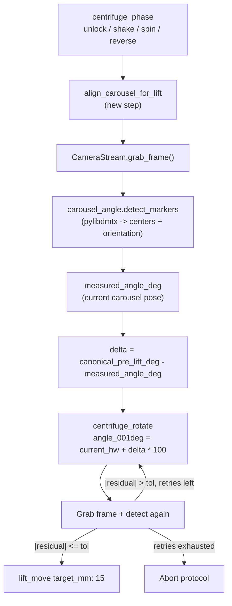

# Carousel Angle Vision Sensing

Design notes for using the onboard USB camera to measure the centrifuge
carousel's true angle and drive it to the canonical pre-lift angle before
the lift assembly descends.

## Goal

After the centrifuge spin stops, the carousel sits at an unknown angle.
Before `lift_move` can lower the lift into the correct slot, we need the
carousel aligned to a known reference angle. Without closed-loop feedback
the open-loop `centrifuge_rotate` / `centrifuge_goto_blister` pair drifts;
with a camera reading DataMatrix markers glued to the carousel we can
measure the true pose and snap the BLDC to the exact target.

Single measurement, single corrective rotate, no downstream offset
bookkeeping.

## Context

- Camera: `src/ultra/hw/camera.py` already grabs frames from `/dev/video0`
  into a shared buffer via a background thread. Today it only exposes an
  MJPEG generator, not a single-frame API.
- Centrifuge motor: `centrifuge_rotate` takes an absolute angle in
  `angle_001deg` units (0.01 deg) and drives the BLDC open-loop.
  Packer: `pack_centrifuge_move_angle` in `src/ultra/hw/frame_protocol.py`.
- Current `centrifuge_phase` in `src/ultra/protocol/recipes/_common.yaml`
  hardcodes `centrifuge_rotate 290` -> `centrifuge_goto_blister` ->
  `lift_move 15 mm` -> `centrifuge_goto_pipette`. We replace the two
  rotates feeding `lift_move` with a vision-guided alignment step.
- Markers on the carousel are DataMatrix (ECC200). `pylibdmtx.decode()`
  returns the 4 corner pixel coords per marker, which gives us both
  center and orientation.

## Data flow



## Angle measurement algorithm

### What the detector returns per marker

`pylibdmtx.decode(frame)` yields for every DataMatrix in the frame:

- `payload` (string) -- e.g. `POS0`, `POS1`, ...
- 4 corner pixel coordinates `p0, p1, p2, p3` in fixed order:
  - `p0` = bottom-left (corner of the solid L)
  - `p1` = bottom-right
  - `p2` = top-right
  - `p3` = top-left

From those, for each marker we derive two independent signals:

1. Marker center `(cx_m, cy_m)` = mean of the four corner pixels.
2. Marker orientation `theta_m` = `atan2(p1.y - p0.y, p1.x - p0.x)`
   in degrees (angle of the solid-L / bottom edge in image coords).

### Signal 1: orientation-based angle (primary)

A DataMatrix rigidly glued to the carousel rotates 1:1 with the carousel.
For any single marker visible in the frame:

```
carousel_angle_now = canonical_angle_at_reference
                   + (theta_m_now - theta_m_reference)
```

This works with a single marker in frame and does not require knowing
the carousel's rotation center in the image. Perspective / camera-mount
error on the center pixel does not propagate into the angle.

If the camera is not perfectly top-down the marker appears stretched at
different carousel positions, which warps `theta_m` slightly (<1 deg
for shallow mount angles). If it is large we add a one-time perspective
unwarp (homography) during reference capture.

### Signal 2: position-around-center angle (cross-check)

Each marker's center traces a circle of radius `R` around the carousel's
rotation axis, which projects to some pixel `(cx_img, cy_img)`:

```
phi_m_now       = atan2(cy_m - cy_img, cx_m - cx_img)
phi_m_reference = atan2(cy_ref - cy_img, cx_ref - cx_img)
carousel_angle_now = canonical_ref + (phi_m_now - phi_m_reference)
```

Requires knowing `(cx_img, cy_img)`. We find it during reference capture
by fitting a circle through marker centers captured at 3-4 known
rotations (least-squares fit).

### Combining the two signals

```
combined_m = 0.7 * delta_theta_m + 0.3 * delta_phi_m
carousel_angle = canonical_ref_deg + median(combined_m over detected markers)
```

Weighting favors orientation (robust to center-calibration error);
position provides a sanity check that rejects marker-identity swaps or
false-positive decodes. If they disagree by more than `outlier_deg`
(say 3 deg), that marker is discarded.

- `N = 0`: return `None` -> alignment step retries, then aborts.
- `N >= 1`: compute as above.

### Marker identity modes

Two modes, chosen automatically from what the bring-up step decodes:

Payload-anchored (each marker has a unique payload): reference JSON stores

```json
{
  "image_center_px": [cx_img, cy_img],
  "canonical_pre_lift_deg": 20.0,
  "markers": {
    "POS0": {"theta_ref_deg": 172.4, "phi_ref_deg":  45.0},
    "POS1": {"theta_ref_deg":  82.4, "phi_ref_deg": 135.0},
    "POS2": {"theta_ref_deg":  -7.6, "phi_ref_deg": -135.0},
    "POS3": {"theta_ref_deg": -97.6, "phi_ref_deg":  -45.0}
  }
}
```

At measurement time we look up the reference row by `payload` -- works
even if the carousel has rotated far from the reference pose, because
identity is absolute.

Geometry-only fallback (all markers identical): match each current marker
to the reference marker whose `phi_ref_deg` is closest to its current
`phi_now_deg` (mod 360). Only unambiguous when the carousel is within
+-45 deg of the reference pose. If this is the mode we end up in, a
coarse open-loop rotate runs before the first measurement so we are
guaranteed to be inside that +-45 deg window.

## Bring-up (before coding)

1. Decode one of the markers from the saved PNG at
   `assets/Image_from_iOS-bd126f80-d19c-4ab2-871f-f4288265cb41.png`
   (`dmtxread` CLI or a quick `pylibdmtx` script) to settle encoding:
   - Unique payloads -> payload-anchored mode.
   - Shared payload  -> geometry-only fallback.
2. Confirm the camera FOV with the carousel installed sees at least one
   marker across the full 360 deg rotation range.
3. Record the canonical "pre-lift" carousel angle -- the exact angle at
   which the lift descends cleanly through the blister port. This is the
   target the corrective rotate aims at.

## Code changes

### 1. Snapshot API on `CameraStream`

In `src/ultra/hw/camera.py`:

- Store the raw BGR frame alongside the JPEG-encoded one, both under the
  existing `_lock`.
- Add `grab_frame(timeout_s: float = 2.0) -> np.ndarray | None` returning
  the latest BGR frame (waits up to `timeout_s` for the background
  capture loop). Does not interfere with the MJPEG generator.

### 2. New vision module

Create `src/ultra/vision/carousel_angle.py`:

```python
@dataclass
class Marker:
    payload: str
    center_px: tuple[float, float]
    corners_px: list[tuple[float, float]]
    orientation_deg: float

def detect_markers(frame) -> list[Marker]: ...

@dataclass
class CarouselReference:
    image_center_px: tuple[float, float]
    canonical_pre_lift_deg: float
    markers: dict[str, dict]  # payload -> {theta_ref_deg, phi_ref_deg}

def measure_angle(
    frame, ref: CarouselReference,
) -> float | None:
    """Return carousel's current absolute angle in deg, or None."""
```

Unit test: load the saved reference PNG, rotate it by a known angle with
`scipy.ndimage.rotate`, run `measure_angle`, assert within 1 deg.

Add `src/ultra/vision/__init__.py`.

### 3. Reference capture

`src/ultra/vision/carousel_ref.py`:

- `capture_reference(camera, pre_lift_deg, n_frames=10) -> CarouselReference`:
  grab N frames, median-filter, detect markers, fit `image_center_px` by
  least-squares circle through marker centers. Persist PNG + JSON to
  `~/sway_runs/vision/carousel_ref.{png,json}`.
- `load_reference(path) -> CarouselReference`.

New block in `config/ultra_default.yaml`:

```yaml
vision:
  carousel:
    enabled: true
    reference_path: ~/sway_runs/vision/carousel_ref.json
    pre_lift_deg: 20.0
    tolerance_deg: 0.5
    max_retries: 3
    settle_ms: 300
    n_frames: 5
    orientation_weight: 0.7
    outlier_deg: 3.0
    image_center_px: null  # auto-fit during reference capture
```

### 4. New protocol step `align_carousel_for_lift`

Register in `src/ultra/protocol/steps.py`:

```python
@step_type('align_carousel_for_lift')
class AlignCarouselForLiftStep(StepExecutor):
    def execute(self, params, runner) -> bool:
        cfg = runner.config.get('vision', {}).get('carousel', {})
        target = params.get('target_deg', cfg.get('pre_lift_deg', 20.0))
        tol = params.get('tolerance_deg', cfg.get('tolerance_deg', 0.5))
        retries = cfg.get('max_retries', 3)

        ref = load_reference(cfg['reference_path'])
        camera = runner.app.camera_or_start()

        for attempt in range(retries + 1):
            time.sleep(cfg.get('settle_ms', 300) / 1000)
            frame = camera.grab_frame()
            measured = measure_angle(frame, ref)
            if measured is None:
                LOG.warning('align_carousel: no markers detected')
                continue
            residual = wrap_180(target - measured)
            if abs(residual) <= tol:
                return True
            if attempt == retries:
                break
            runner.stm32.send_command(cmd={
                'cmd': 'centrifuge_move_angle',
                'angle_001deg': int(round(
                    (measured + residual) * 100,
                )),
                'move_rpm': 100,
            })
        return False
```

Register metadata in the `CMD_DOCS` / `CMD_PARAMS` tables.

### 5. Recipe integration

Edit `src/ultra/protocol/recipes/_common.yaml`:

```yaml
centrifuge_phase:
  steps:
    - type: set_loc_offset
    - type: centrifuge_unlock
    - type: centrifuge_shake
    - type: centrifuge_spin
      rpm: 500
      duration_s: 360

    # Replaces centrifuge_rotate(29000) + centrifuge_goto_blister.
    - type: align_carousel_for_lift
      label: Vision-align carousel for lift

    - type: lift_move
      target_mm: 15.0

    - type: centrifuge_goto_pipette
      label: Rotate to pipette position
```

Because `_common.yaml` is shared, every recipe inherits the fix.

### 6. GUI engineering panel (bring-up + live debug)

`src/ultra/gui/api_stm32.py`:

- `POST /carousel/capture_reference` -> runs `capture_reference(...)`.
- `GET /carousel/measure_angle` -> runs a single measurement, returns
  `{measured_deg, delta_deg, n_markers, annotated_jpeg_b64}`.

`src/ultra/gui/static/ultra-engineering.js` adds two buttons to the
engineering cartridge panel:

- "Capture Reference (at canonical pre-lift angle)"
- "Measure Angle"

### 7. Dependencies

In `pyproject.toml`:

- `pylibdmtx>=0.1.10`.

In `scripts/start.sh` or this README note the system package:

```bash
sudo apt install libdmtx0b
```

## Edge cases / guardrails

- No markers detected: retry up to `max_retries` times, then fail the
  step and abort the protocol. Safer than lowering the lift blind.
- Reference file missing: step fails immediately with a clear error
  asking the operator to run the reference capture once. Lab machines
  stay explicit about calibration state.
- `|delta|` exceeds some sanity bound (e.g. >45 deg on first measurement):
  still attempt the corrective rotate, but log a warning -- large deltas
  may mean markers were decoded in the wrong order (payload collision)
  or the carousel is installed upside down.
- Camera and MJPEG stream active simultaneously: `grab_frame` reads from
  the same `_lock`-protected buffer the MJPEG generator already uses, so
  no contention.
- `centrifuge_move_angle` wraparound: `angle_001deg` takes absolute
  angles; shortest-path wrap is handled inside firmware. `wrap_180(target
  - measured)` keeps the delta in `[-180, 180]` before we add it to
  `measured`.

## Open questions for bring-up

1. Does `lift_move` need alignment just before and some other step later
   (e.g. before the pipette goto)? Current spec keeps `goto_pipette`
   open-loop, but we can re-invoke `align_carousel_for_lift` with a
   different `target_deg` later in the phase if needed.
2. Is the camera physically mounted such that the carousel's rotation
   axis is perpendicular to the image plane (i.e. carousel shows as a
   true circle, no homography needed)? If it is angled, add a one-time
   homography calibration in `carousel_ref.py`.
