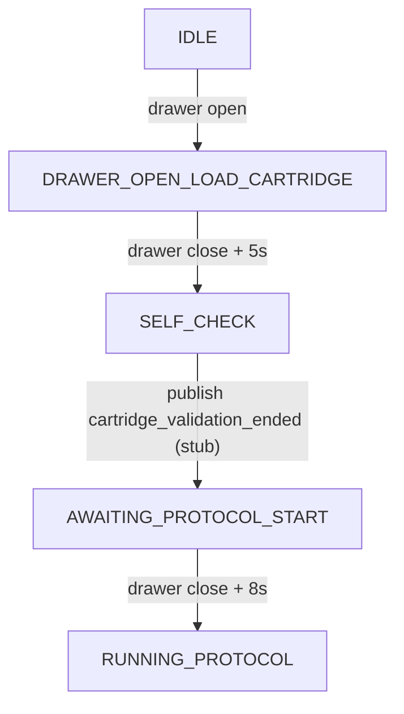
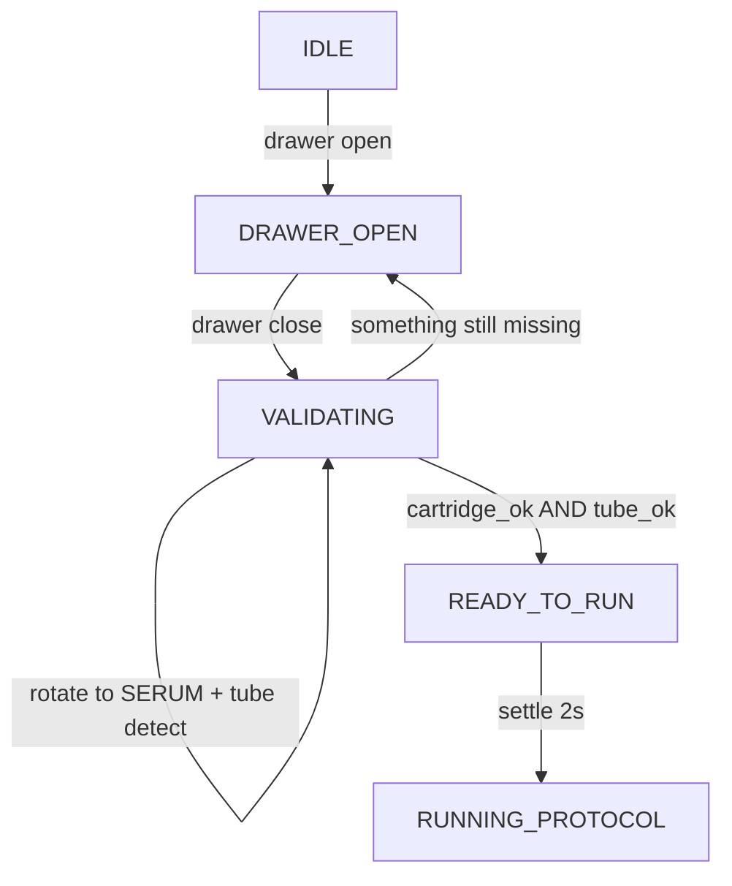

# Cartridge QR + Serum Tube Validation

> Design doc for adding real cartridge (QR) and serum-tube presence checks to
> the pre-run workflow. This is the plan of record; see the Open Items section
> at the bottom for what still requires on-device calibration.

## 1. Goals

- Replace the stub `_state_self_check` in [src/ultra/services/state_machine.py](../src/ultra/services/state_machine.py) with real vision checks.
- Move from a rigid 2-step sequence (`DRAWER_OPEN_LOAD_CARTRIDGE` -> `SELF_CHECK` -> `AWAITING_PROTOCOL_START`) to an **order-free counter**: on every drawer-close, run both the QR check and the tube check; advance to `RUNNING_PROTOCOL` only when `cartridge_ok AND tube_ok`.
- Surface failures to the cloud/mobile app using the **existing canonical events** defined in [siphox-cloud-service `src/device_events.py`](https://github.com/siphox-inc/siphox-cloud-service/blob/main/src/device_events.py). No new event strings.
- No new Python dependencies; reuse `opencv-python-headless` (`cv2.QRCodeDetector`) and the existing `pylibdmtx` dmtx path only if DataMatrix is the chosen cartridge code format (QR default).

### Cloud event contract (authoritative -- pulled from `siphox-cloud-service`)

`DeviceEvent` in `src/device_events.py` accepts these persisted event types. Only the subset relevant to the pre-run state machine is shown; anything else we emit will be stored but not drive mobile-app navigation:

- Drawer / load: `drawer_open`, `drawer_closed`, `cartridge_inserted`, `cartridge_removed`
- Cartridge validation (three-state): `cartridge_validation_started`, `cartridge_validation_ended`, `cartridge_validation_failed`
- Self-check (three-state): `self_check_started`, `self_check_complete`, `self_check_failed`
- Readiness / errors: `device_ready`, `device_not_ready`, `cartridge_error`, `device_error`
- Protocol: `test_started`, `test_completed`, `test_failed`, `device_test_finished`

The cloud IoT handler ([`src/handlers/iot/report_event.py`](https://github.com/siphox-inc/siphox-cloud-service/blob/main/src/handlers/iot/report_event.py)) accepts `{device_id, event_type|status, cartridge_id, timestamp, state}`. The mobile app (per `docs/CLOUD_EVENT_LOGIC_MAP.md` in the cloud repo) only **navigates** on `device_ready`, `drawer_open`, `cartridge_inserted`, `drawer_closed`, `cartridge_validation_ended`, `device_test_finished`; other events are stored + humanized in UI without driving transitions.

**Mapping we will adopt:**

- QR check: `cartridge_validation_started` (on entry) -> `cartridge_validation_ended` (pass) or `cartridge_validation_failed` (fail)
- Tube check: `self_check_started` (on entry) -> `self_check_complete` (pass) or `self_check_failed` (fail)
- All retries still covered by the above three-state pattern; only the final outcome per drawer cycle is published.

## 2. Current state machine (reference)

Reads as "two hard-coded door cycles, SELF_CHECK is a stub" -- see [src/ultra/services/state_machine.py](../src/ultra/services/state_machine.py) L715-L783.



Today `skip_qr` (L122) is read but never consulted; `cartridge_inserted` is a 5 s timer (L203-L213), not a sensor. Drawer edges come from `STM32StatusMonitor._door_handler` (see [src/ultra/hw/stm32_monitor.py](../src/ultra/hw/stm32_monitor.py) L445-L475).

## 3. Proposed state machine (order-independent)

The two checks operate on independent physical items (cartridge body vs serum-tube slot on the carousel) with independent camera poses, so we can run **both** checks on **every** drawer-close and just latch the flags. There are no "first cycle" or "second cycle" states: the machine only cares whether both flags are True.



Worked cases (all converge):

| Cycle 1 load | Detect on cycle 1 | Flags after | Cycle 2 load | Detect on cycle 2 | Flags after | Outcome |
| --- | --- | --- | --- | --- | --- | --- |
| Cartridge only | QR pass, tube fail | C=T, T=F | Adds tube | QR pass, tube pass | C=T, T=T | Run on cycle 2 |
| Tube only | QR fail, tube pass | C=F, T=T | Adds cartridge | QR pass, tube pass | C=T, T=T | Run on cycle 2 |
| Both at once | QR pass, tube pass | C=T, T=T | -- | -- | -- | Run on cycle 1 |
| Empty | QR fail, tube fail | C=F, T=F | Adds both | both pass | C=T, T=T | Run on cycle 2 |

Flags **latch True** -- once a check has passed, later re-closes do not re-run that check (saves motion time and avoids perturbing the loaded item). Flags only reset when the machine returns to `IDLE` (after `PROTOCOL_COMPLETE -> IDLE`).

State-local data held on `UltraStateMachine`:

- `self._cartridge_ok: bool`
- `self._tube_ok: bool`
- `self._close_count: int` (monotonic, for `extra` payload on cloud events)
- `self._last_qr_payload: str | None`

## 4. Vision detectors (new, minimal)

### `src/ultra/vision/qr_detect.py` (new)

Detector: **`cv2.QRCodeDetector` only** (already bundled in `opencv-python-headless>=4.8`). No new runtime deps; no `pyzbar` / `wechat_qrcode` in the default build. No training -- QR is a standardized symbology.

- Public API: `detect_qr(frame_bgr: np.ndarray, min_payload_len: int = 1) -> QrDetection | None` returning `QrDetection(payload: str, corners: np.ndarray, bbox: tuple[int,int,int,int])`.
- Three-pass decoder pipeline (stop on first hit):
  1. **Raw grayscale**: `cv2.QRCodeDetector().detectAndDecode(gray)`.
  2. **CLAHE preprocess** (clipLimit=2.0, tileGridSize=(8, 8)) for low-contrast stickers; mirrors the CLAHE path already trusted in [src/ultra/vision/carousel_align.py](../src/ultra/vision/carousel_align.py).
  3. **Adaptive threshold** (`cv2.adaptiveThreshold`, Gaussian, block=31, C=7) to normalize harsh lighting / glare.
- Multi-code: expose `detect_qr_multi` backed by `detectAndDecodeMulti` for cartridges that carry more than one sticker; only used if config says so.
- Tunables in `config/ultra_default.yaml`: `checks.qr.min_payload_len`, `checks.qr.retries_per_close`, `checks.qr.led_settle_ms`.
- DataMatrix escape hatch: if the production cartridge ships with a DataMatrix rather than a QR, a `format: datamatrix` config flag reroutes through the existing [src/ultra/vision/dmtx_detect.py](../src/ultra/vision/dmtx_detect.py) `decode_with_corners`. Same `QrDetection` shape returned so `check_runner` does not branch.

### `src/ultra/vision/tube_detect.py` (new)

The serum tube sits in a slot on the carousel at the `SERUM` station. The cartridge is drawer-locked with the slot already in the toolhead camera's FOV -- **no carousel rotation is issued**. We drive the toolhead to the configured probe pose and look straight down with the ring LED on. **No machine learning and no training** -- presence is decided by classical CV with two independent backends, both computed inside a calibrated ROI (calibration values, not learned weights).

The detector has two verdict paths, picked automatically per call:

1. **Template matching** (preferred when refs exist). Labelled reference ROI crops captured from this specific machine are NCC-scored against the current ROI. Winning class is the predicted label. Captures machine-specific lighting, handles any cap colour including white, trivially extensible.
2. **Saturation fallback** (always available). If the reference set is empty for either class (first boot, or the operator hasn't calibrated yet), the detector uses HSV saturation inside the ROI as the primary gate. Colour-agnostic across coloured caps; only weakness is white/transparent caps.

- Public API: `detect_tube(frame_bgr, *, roi, dark_threshold, mean_intensity_min, dark_ratio_max, mean_saturation_min, templates=None, template_min_score, template_margin, template_search_px) -> TubeDetection`. The returned dataclass carries every sub-signal: `present, method, seated_score, empty_score, seated_count, empty_count, mean_intensity, dark_ratio, mean_saturation, stage1_pass, stage2_pass, roi, reason, annotated`.
- **Template backend (`src/ultra/vision/tube_template.py`, active when `templates` is populated)**:
  - Saves per-machine reference ROI crops under `checks.tube.templates.dir` (PNG, `seated_<ts>.png` / `empty_<ts>.png`).
  - For each check, every reference is NCC-scored (`cv2.matchTemplate`, `TM_CCOEFF_NORMED`) against the current ROI with a small reflection-padded search window (`template_search_px`, default +/-5 px) to absorb slot jitter.
  - Class score = max NCC across all refs of that class. Verdict is SEATED iff `seated_score >= empty_score + margin` AND `max(seated, empty) >= min_score`. Failures surface as `template_low_confidence` (nothing matches well, likely ROI drift or camera covered) or `template_empty_match` (empty class scored higher) or `template_insufficient_refs` (at least one class has zero refs saved).
  - Size-mismatched refs (e.g. captured before an ROI edit) are skipped at load time with a warning; no crashes, just a shrinking usable ref count until the operator recaptures.
- **Stage 1 -- intensity statistics (ROI only)**:
  - Crop to the configured `roi` (pixel box inside the 1280x720 frame).
  - Convert to grayscale, apply CLAHE (clipLimit=2.0, tile=(8,8)).
  - Compute `mean_intensity` and `dark_ratio = count(pixels < dark_threshold) / total_pixels`.
  - Rule: `stage1_pass = mean_intensity >= mean_intensity_min AND dark_ratio <= dark_ratio_max`.
  - Rationale: filters pathological lighting (slot in shadow, camera obscured). Not the primary discriminator for presence; Stage 2 carries that load.
- **Stage 2 -- HSV saturation (ROI only)**:
  - Convert the ROI crop to HSV, compute `mean_saturation` on the S channel (0..255 scale).
  - Rule: `stage2_pass = mean_saturation >= mean_saturation_min`.
  - Rationale: a tube cap of **any** colour dumps chroma into the slot (blue cap, red cap, green cap, etc. all register high S); an empty slot of white plastic stays near-achromatic (low S). This is colour-agnostic, scale-tolerant, and immune to the label-letters-look-like-circles false-positive that Hough exhibited. See commit history for the reasoning behind dropping Hough.
- Final verdict: `present = stage1_pass AND stage2_pass`.
- **Why not Hough circles?** Earlier prototypes ran `cv2.HoughCircles` on the CLAHE grayscale as Stage 2. Two failure modes dominated: (a) **false positives on a full-frame ROI** -- the detector picked cartridge label letters ("O", "S") as circles when the slot was empty; (b) **false negatives on red caps** -- a red cap on a red tube body has poor grayscale edges, so Hough missed it entirely. Saturation inside a tight ROI fixes both.

### `src/ultra/vision/check_runner.py` (new, mirrors [src/ultra/vision/align_runner.py](../src/ultra/vision/align_runner.py))

Single entry point used by the state machine (and optionally by an engineering GUI button and a protocol step later):

```python
def run_cartridge_qr_check(*, stm32, config, get_frame) -> CheckResult: ...
def run_serum_tube_check(*, stm32, config, get_frame) -> CheckResult: ...
```

Each:

1. Issues the needed motion (QR: `move_gantry` to `checks.qr.probe_pose`; tube: `move_gantry` to `checks.tube.probe_pose` -- **no carousel rotation**, the cartridge is drawer-locked with the serum slot already in the toolhead camera's FOV). No `ensure_centrifuge_ready` gate here -- SELF_CHECK runs immediately after a drawer close, when the BLDC has been idle for seconds; the gate added 0.5--1 s of latency and could itself fail (BLDC ERROR) when nothing was actually spinning. `align_runner` keeps the gate before the spin-heavy carousel alignment phase, which is the actual risky workload.
2. Toggles `stm32.cam_led_set(True)`, waits `led_settle_ms`, grabs a fresh BGR frame via `cam.latest_frame_bgr(newer_than=..., wait_s=...)`, runs the detector, turns LED off in `finally`.
3. Caches an annotated frame to disk for GUI readback (same pattern as `_cache_annotated_frame` in [src/ultra/gui/api_stm32.py](../src/ultra/gui/api_stm32.py) L760-L777).

## 5. State machine wiring

Edits confined to [src/ultra/services/state_machine.py](../src/ultra/services/state_machine.py):

- Keep the existing `SystemState` enum values unchanged so cloud / GUI / `api_stm32.py` consumers don't churn. Only the handler bodies change. In the new flow, `AWAITING_PROTOCOL_START` is no longer reached on the happy path: once both flags latch, `_state_self_check` transitions directly to `RUNNING_PROTOCOL`. If either flag is still False after running the needed checks, the handler awaits the next drawer-open edge and transitions back to `DRAWER_OPEN_LOAD_CARTRIDGE`.
- Rewrite `_state_self_check` to run the order-free validation loop. On each entry (triggered by a `drawer_closed` edge):
  - If `self._cartridge_ok` is False, publish `cartridge_validation_started`, run `run_cartridge_qr_check`; on success publish `cartridge_validation_ended` once both flags are True (see deferral rule below) and latch `self._cartridge_ok = True`; on failure publish `cartridge_validation_failed` with `{reason, close_count}` in `extra` and leave the flag False.
  - If `self._tube_ok` is False, publish `self_check_started`, run `run_serum_tube_check` (shared camera -> serialized after QR); on success publish `self_check_complete` and latch `self._tube_ok = True`; on failure publish `self_check_failed` with `{reason, close_count}`.
  - Flags **latch across drawer cycles**; a passing check is not re-executed on subsequent closes.
- After validation, `if self._cartridge_ok and self._tube_ok:` advance to `RUNNING_PROTOCOL`; else return to `DRAWER_OPEN` (await next open/close; `_close_count += 1` on each close).
- Seed the flags + counter in `_state_idle` (reset to `False, False, 0`).
- Honour `startup.skip_qr` (already in config, already loaded at L118-L122) to short-circuit `cartridge_ok = True` for bench work; add matching `startup.skip_tube_check`.

### Event ledger per drawer cycle

No new event-name strings are introduced. Every outcome uses a canonical value from `siphox-cloud-service/src/device_events.py`. **Policy: emit failure events on every cycle they occur**. The cloud persists them and the mobile app tolerates unknown-to-navigation events per the cloud `docs/CLOUD_EVENT_LOGIC_MAP.md`.

| Moment | event_type | Notes |
| --- | --- | --- |
| Door edge opens | `drawer_open` | Unchanged (already emitted from `_door_handler`) |
| Door edge closes | `drawer_closed` | Unchanged |
| QR attempt starts | `cartridge_validation_started` | Emitted only when the check actually runs (i.e. flag still False) |
| QR attempt passes | (nothing yet -- deferred) | Flag latches locally |
| QR attempt fails | `cartridge_validation_failed` | Every cycle that fails; `{reason, close_count}` in `extra` |
| Tube attempt starts | `self_check_started` | Emitted only when the check actually runs (flag still False) |
| Tube attempt passes | `self_check_complete` | Emitted immediately on pass |
| Tube attempt fails | `self_check_failed` | Every cycle that fails; `{reason, close_count}` in `extra` |
| Both flags True (end of validation) | `cartridge_validation_ended` | Emitted once, on the transition `VALIDATING -> READY_TO_RUN` |

Why defer `cartridge_validation_ended`: per the mobile app flow in the cloud repo's `docs/CLOUD_EVENT_LOGIC_MAP.md`, that event is the navigation gate to `StartCollection`. If we emitted it the moment QR passed, the app would advance before the tube check completed. Deferring it to the transition into `RUNNING_PROTOCOL` keeps the existing app contract intact with no app-side changes required.

## 6. Configuration additions

Extend [config/ultra_default.yaml](../config/ultra_default.yaml) with a new top-level `checks:` block (keep `carousel_align` untouched):

```yaml
checks:
  qr:
    enabled: true
    format: qr               # qr | datamatrix
    min_payload_len: 4
    retries_per_close: 2
    led_settle_ms: 200
    probe_pose:              # toolhead-camera pose over cartridge QR label
      x_mm: 0.0
      y_mm: 83.0
      z_mm: 0.0
      xy_speed_mms: 40.0
      z_speed_mms: 10.0
  tube:
    enabled: true
    retries_per_close: 1
    led_settle_ms: 200
    probe_pose:              # toolhead-camera pose over serum slot
      x_mm: 20.0
      y_mm: 55.0
      z_mm: 0.0
      xy_speed_mms: 40.0
      z_speed_mms: 10.0
    roi:                     # pixel box inside the 1280x720 frame
      x: 0
      y: 0
      w: 0
      h: 0
    # Stage 1 (intensity statistics, ROI only)
    dark_threshold: 60       # pixel value cutoff for "dark"
    mean_intensity_min: 90   # ROI mean must exceed this when tube present
    dark_ratio_max: 0.35     # dark-pixel fraction must stay below this
    # Stage 2 (HSV saturation, ROI only)
    mean_saturation_min: 40.0  # 0..255; empty=5-20, seated=60+
    # Template-matching backend (preferred when refs present)
    templates:
      enabled: true
      dir: tube_refs           # PNG refs, project-root-relative
      min_score: 0.5           # winning NCC floor
      margin: 0.05             # seated_score must beat empty by this
      search_px: 5             # slot-jitter tolerance (+/- px)
```

Pose values fixed by operator measurement:

- QR: `(x: 0.0, y: 83.0, z: 0.0)` mm -- camera over cartridge QR label.
- Tube: `(x: 20.0, y: 55.0, z: 0.0)` mm -- camera over serum slot after `centrifuge_goto_serum`.

`z_mm: 0.0` mirrors the existing `carousel_align.probe_pose` Z (no descent). If on-device testing shows either feature is out of focus or the ROI needs a closer view, Z can be lowered during the verify step.

Still to calibrate on-device:

- `checks.tube.roi` (pixel box enclosing the slot in the 1280x720 frame). Use the drag-to-select overlay in the Engineering Camera pane, or paste measured coords directly.
- **Template references** (the preferred detector): capture 3-5 SEATED and 3-5 EMPTY ROI crops via the Engineering panel's **Capture as SEATED / EMPTY** buttons. Nothing else is needed while refs are present on this machine.
- `checks.tube.dark_threshold`, `mean_intensity_min`, `dark_ratio_max`, `mean_saturation_min` -- still required as a fallback when references are unavailable; derive from 5-empty + 5-with-tube reference captures.

## 7. GUI surface (minimal)

- Add `GET /api/camera/last-qr-frame` and `GET /api/camera/last-tube-frame` to [src/ultra/gui/api_stm32.py](../src/ultra/gui/api_stm32.py) (mirror `/api/camera/last-alignment-frame` L760-L777).
- Add two engineering-panel buttons ("Check Cartridge QR", "Check Serum Tube") that call `check_runner` directly, for calibration/debug. No user-facing UI change in `ultra-running.js` required for the state machine path; canonical cloud events flow through the existing event renderer.

## 8. Recipe impact

None. The checks run **before** the recipe starts, in the `UltraStateMachine` supervisor. `align_to_carousel` inside `_common.yaml#centrifuge_phase` is unchanged.

## 9. Implementation todos

- [x] **sm_wiring** -- Rewrote `_state_self_check` in [src/ultra/services/state_machine.py](../src/ultra/services/state_machine.py) for order-free flag latching (`_cartridge_ok`, `_tube_ok`, `_close_count`). Kept `SystemState` enum values unchanged; `AWAITING_PROTOCOL_START` is no longer reached in the happy path (the machine goes `SELF_CHECK -> RUNNING_PROTOCOL` once both flags latch, or back to `DRAWER_OPEN_LOAD_CARTRIDGE` if either flag is still False). Flags reset in `_state_idle`.
- [x] **qr_module** -- Added [src/ultra/vision/qr_detect.py](../src/ultra/vision/qr_detect.py) using `cv2.QRCodeDetector` with the three-pass ladder (raw -> CLAHE -> adaptive threshold). `format='datamatrix'` escape hatch reroutes through `pylibdmtx` via [src/ultra/vision/dmtx_detect.py](../src/ultra/vision/dmtx_detect.py). Unit tests in [tests/vision/test_qr_detect.py](../tests/vision/test_qr_detect.py).
- [x] **tube_module** -- Added [src/ultra/vision/tube_detect.py](../src/ultra/vision/tube_detect.py): Stage 1 intensity stats (CLAHE + mean + dark-ratio inside ROI), Stage 2 HSV mean saturation inside ROI. No ML. Unit tests in [tests/vision/test_tube_detect.py](../tests/vision/test_tube_detect.py). **Hough circle confirmation was tried and removed** -- it produced false positives on label letters when the ROI was still the full frame, and false negatives on red caps against a red tube body (grayscale-edge-colour-blind). Saturation inside a calibrated ROI is colour-agnostic.
- [x] **check_runner** -- Added [src/ultra/vision/check_runner.py](../src/ultra/vision/check_runner.py) mirroring `align_runner`: `run_cartridge_qr_check` and `run_serum_tube_check`, gantry + LED + fresh frame + detect + annotated-frame cache hook. No carousel rotation issued for tube detection (cartridge is drawer-locked with the slot already in FOV). The `ensure_centrifuge_ready` safety gate was originally included here but was later removed -- see the module docstring for the rationale (SELF_CHECK runs after a drawer close when the BLDC is already idle; `align_runner` still gates the spin-heavy alignment phase).
- [x] **config** -- Added the `checks.qr` and `checks.tube` blocks to [config/ultra_default.yaml](../config/ultra_default.yaml); added `startup.skip_tube_check`; flipped `startup.skip_qr` default to `false`.
- [x] **events** -- State machine emits cloud-canonical events only: `cartridge_validation_started`/`cartridge_validation_failed` per cycle + deferred `cartridge_validation_ended` once both flags latch; `self_check_started`/`self_check_complete`/`self_check_failed` per cycle. No new event strings introduced.
- [x] **gui_debug** -- Added `GET /api/camera/last-qr-frame`, `GET /api/camera/last-tube-frame`, `POST /api/camera/check-cartridge-qr`, `POST /api/camera/check-serum-tube` in [src/ultra/gui/api_stm32.py](../src/ultra/gui/api_stm32.py). Two engineering-panel buttons ("Check Cartridge QR", "Check Serum Tube") wired up in [src/ultra/gui/static/index.html](../src/ultra/gui/static/index.html) + [src/ultra/gui/static/ultra-engineering.js](../src/ultra/gui/static/ultra-engineering.js).
- [x] **gui_roi_picker** -- `GET/POST /api/camera/tube-roi` in [src/ultra/gui/api_stm32.py](../src/ultra/gui/api_stm32.py) + drag-to-select overlay in the Serum Tube fieldset of [src/ultra/gui/static/index.html](../src/ultra/gui/static/index.html) and [src/ultra/gui/static/ultra-engineering.js](../src/ultra/gui/static/ultra-engineering.js). Save updates `app.config` in memory; the response echoes the values + a hint for pasting into `config/ultra_default.yaml` for restart durability.
- [x] **template_matching (Tier 1)** -- Added [src/ultra/vision/tube_template.py](../src/ultra/vision/tube_template.py) (save/list/load refs, NCC with search window, classifier with `min_score` / `margin` gates). `detect_tube` now prefers the template path when both classes have refs; saturation is the fallback. API endpoints: `GET/POST /api/camera/tube-refs`, `DELETE /api/camera/tube-refs/{filename}`, `GET /api/camera/tube-refs/{filename}` (thumbnail). GUI: **Capture as SEATED / EMPTY** buttons + thumbnail gallery with per-ref delete, in the Serum Tube fieldset. Refs stored under `tube_refs/` (git-ignored). Tests in [tests/vision/test_tube_template.py](../tests/vision/test_tube_template.py).
- [ ] **verify** -- On-device: calibrate `checks.tube.roi` via the GUI picker, capture template refs (9a.3) OR tune saturation thresholds (9a.2) as fallback, flip `startup.skip_tube_check` to `false`, dry-run happy + each recovery path, attach log excerpt.

## 9a. On-device calibration procedure (the `verify` step)

The vision detectors ship with conservative placeholder thresholds and a zero-sentinel ROI (full frame). Lock these down on the first unit using the engineering-panel buttons.

### 9a.1 QR pose tune (quick)

1. In the Engineering Camera pane, press **Check Cartridge QR** with a known-good cartridge loaded.
2. If the panel shows `ok: true`, the pose / LED settle are already good -- no change needed.
3. If `reason: no_qr_detected` persists, open `config/ultra_default.yaml` and nudge `checks.qr.probe_pose.y_mm` (default 83) +/-3 mm until the cached frame at `GET /api/camera/last-qr-frame` shows the full QR with a clean quiet zone; retry.

### 9a.2 Tube ROI (~2 min)

1. Load a cartridge **with a seated serum tube** and press **Check Serum Tube**. The panel caches the most recent annotated frame; a saved ROI (if any) is drawn on it as a dashed green box.
2. **Calibrate the ROI** using the drag-to-select overlay directly on the cached frame:
   - Drag a rectangle that tightly encloses only the serum slot (no label, no housing, no cartridge logo). The "draft" values appear under the image in native-frame pixels.
   - Click **Save ROI**. The server (a) updates `app.config['checks']['tube']['roi']` in memory, (b) writes the value into `/etc/ultra/machine.yaml` (the `ULTRA_CONFIG` overlay loaded on startup) so it survives a restart, and (c) best-effort pushes to S3 via the existing machine-settings flow when a `device_sn` is configured. The status line under the image reports exactly which of those three landed; no manual YAML edits required.
3. The ROI is now locked. Proceed to 9a.3 to capture template references (preferred) or 9a.4 for the saturation fallback.

### 9a.3 Template reference capture (preferred, ~2 min)

With the ROI already saved from 9a.2 and a known-good cartridge:

1. Load the cartridge **with a seated tube**, press **Check Serum Tube**. Then press **Capture as SEATED** in the Serum Tube fieldset. A thumbnail appears in the gallery labelled SEATED with its capture time. Repeat 3-5 times, optionally varying cap colour / orientation to cover the fleet's tolerance.
2. Remove the tube (leave the cartridge), press **Check Serum Tube**, then **Capture as EMPTY**. Repeat 3-5 times.
3. Re-run **Check Serum Tube** with and without a tube. The result panel now shows `method: template` and two NCC scores. Seated runs should show `seated > empty` with both scores >= 0.6; empty runs the opposite. Anything closer than 0.05 between scores is noise -- capture more refs.
4. Refs live in `tube_refs/` at the repo root (git-ignored). Back up that directory when imaging a unit; copy it onto a new unit to skip recalibration.
5. If the ROI is later edited, old refs no longer match the new crop size. They're skipped at load time with a warning; recapture to restore template matching, or delete old entries from the gallery.

Operator signal: **the gallery is the calibration state**. No YAML edit is needed for template matching to turn on.

### 9a.4 Saturation threshold tune (fallback only, skip if template refs exist)

If for some reason the template backend cannot be used (e.g. fleet variance too high, or a brand-new unit before first calibration), tune the saturation path:

1. Re-press **Check Serum Tube** five times with the tube seated, then remove the tube and press five more times. The panel shows `mean_intensity`, `dark_ratio`, and `mean_saturation` per run.
2. `mean_saturation_min` ~= midpoint between the two saturation means, biased 20% toward the seated mean (empty ~5-20, seated ~60-120).
3. `mean_intensity_min` / `dark_ratio_max` tuned likewise -- these are pathological-lighting gates, not presence gates.
4. Re-run 5 empty + 5 seated. Every empty must show `ok: false` and every seated must show `ok: true`.
5. Flip `startup.skip_tube_check` to `false` in `config/ultra_default.yaml` and restart the service.

### 9a.5 End-to-end happy path

After calibration, with no cartridge in the machine:

1. Open the drawer, insert the cartridge + serum tube, close the drawer.
2. Confirm in `journalctl -u ultra-rpi` that `SELF_CHECK cycle 1` logs followed by both `QR check passed` and `Tube check passed`, then `All checks passed on cycle 1 -- starting protocol`.
3. Confirm in the cloud event ledger (or local mock) that `cartridge_validation_started`, `self_check_started`, `self_check_complete`, and `cartridge_validation_ended` all appear in that order. `cartridge_validation_failed` and `self_check_failed` must be absent.

### 9a.6 Happy-path log excerpt (reference)

Attach the operator's trace from 9a.3 below once validated. Template:

```text
YYYY-MM-DD HH:MM:SS INFO [ultra.services.state_machine] SELF_CHECK cycle 1 (cartridge_ok=False, tube_ok=False)
YYYY-MM-DD HH:MM:SS INFO [ultra.services.state_machine] QR check passed (payload='L007W01R01C01')
YYYY-MM-DD HH:MM:SS INFO [ultra.services.state_machine] Tube check passed
YYYY-MM-DD HH:MM:SS INFO [ultra.services.state_machine] All checks passed on cycle 1 -- starting protocol
YYYY-MM-DD HH:MM:SS INFO [ultra.services.state_machine] State -> running_protocol: Running protocol...
```

### 9a.7 Recovery-path spot checks

- Cartridge-only load: confirm `cartridge_validation_failed` (no QR yet) or `self_check_failed` (no tube) is emitted, machine returns to `DRAWER_OPEN_LOAD_CARTRIDGE`, and the second close clears the remaining flag without re-running the already-passing check.
- Tube-only load: symmetric case.
- Empty / wrong-orientation cartridge: confirm `cartridge_validation_failed` with a stable `reason` string; the machine must not advance.

## 10. Open items

- Tube-ROI coordinates depend on camera resolution (`1280x720` today) and the seeded `tube.probe_pose = (20, 55, 0)` -- expect a 10-15 min on-device calibration after the code lands to lock in `roi` and the four Stage 1/2 thresholds.
- QR `z_mm` may need to drop below 0 if the camera cannot resolve the code from the default Z at pose `(0, 83, 0)`; confirm during verify.
- Mobile-app gap: today the app treats `cartridge_validation_failed` / `self_check_failed` as unknown-but-tolerated events (shown as humanized text but no navigation). We keep emitting them for cloud observability + admin portal; a follow-up app change can later add explicit error screens. No ultra-rpi work is blocked by this.
